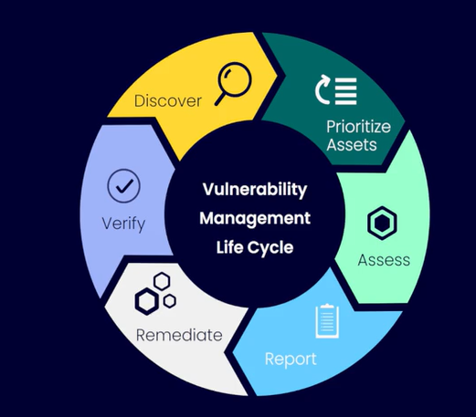
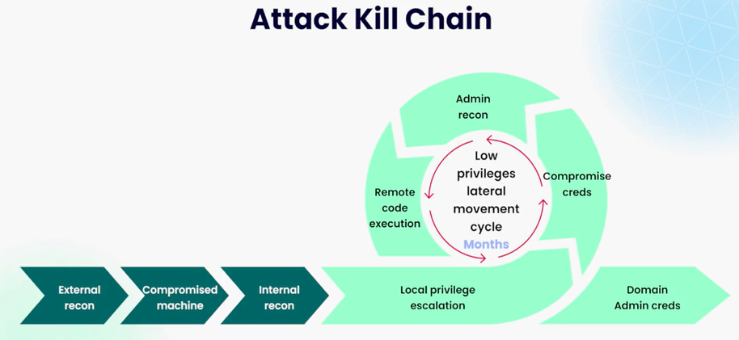
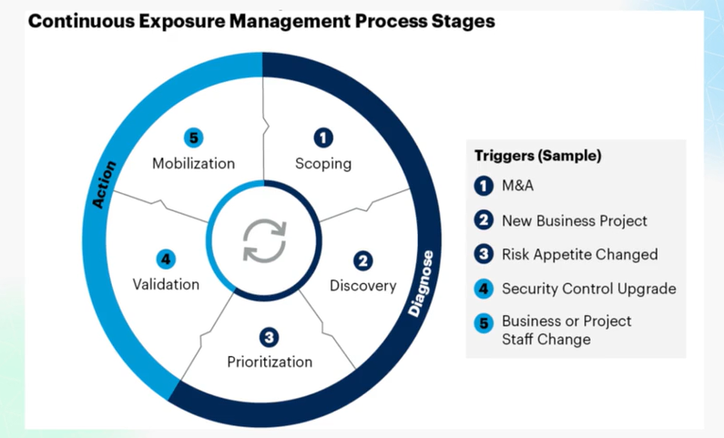
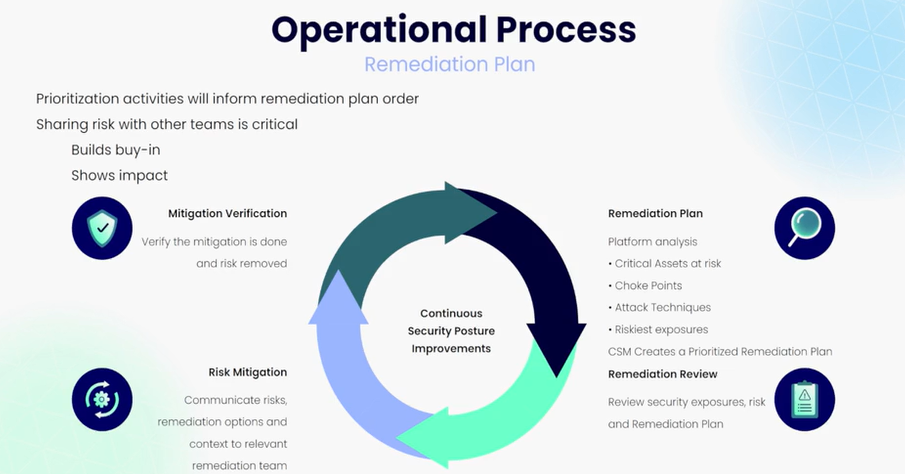
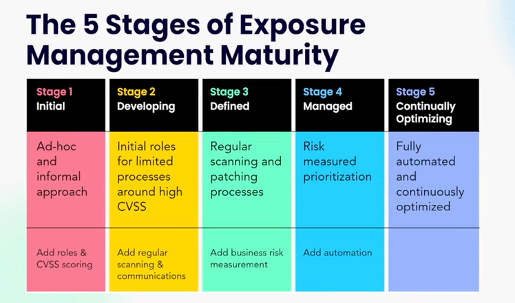

# Gestione delle vulnerabilità

## Tipi di vulnerabilità

- Common Vulnerability and Exposure (CVE)
- Misconfigurazione di apparati e servizi
- Malagestione delle credenziali
- Infrastruttura IT non gestita (Shadow IT)

Di seguito immagina che riassume il ciclo di vita della gestione delle vulnerabilità.

  

Nel mondo infosec si affiancano diverse figure che collaborano per raggiungere una protezione completa di un'azienda:

- **GRC**
- **SecOps**
- **IdAM**
- **Vulnerability Management**
- **SecTech**

L'analisi delle vulnerabilità condotto tradizionalmente in un rapporto uno a uno con gruppi di apparati o servizi, rende difficile individuare le vulnerabilità dell'infrastruttura nel suo insieme e di ordinarle secondo una scaletta di priorità.  
La gestione dell'esposizione (exposure management) agli attacchi è l'evoluzione della gestione delle vulnerabilità.  

Adottare un [programma di gestione continua dell'esposizione alle minacce](https://www.gartner.com/en/articles/how-to-manage-cybersecurity-threats-not-episodes) significa monitorare costantemente la superficie d'attacco aziendale nel suo insieme e gestire le aree più critiche in quanto impossibile coprire ogni angolo scoperto.  

# Componenti dell'Exposure Management

## Attack Surface

Somma di tutti i punti d'ingresso alla rete dai quali un attaccante, dopo averne trovato uno aperto o vulnerabile, accede alle risorse interne.  

Hardening dei sistemi e applicazioni, riduzione del numero di endpoint e applicazioni che hanno accesso alla rete, training del personale (*weakest link in the chain*), blocchi di sicurezza per identificare tentativi di intrusione... sono alcune delle azioni che si possono implementare al fine di ridurre la superficie d'attacco.  

Identificare i path di attacco che un attaccante può concatenare o seguire al fine di aggirare o superare i controlli di sicurezza, permette di individuare lacune nella posture generale a cui rimediare.  

La CKC, [Cyber Kill Chain](https://www.splunk.com/en_us/blog/learn/cyber-kill-chains.html), permette di mappare in 7 step le fasi di un attacco.  

La superficie d'attacco è dinamica in quanto l'infrastruttua IT difficilmente rimane immutabile per più di 24 ore, basta che un solo servizio sia aggiornato che nuove vulnerabilità possono essere facilmente introdotte nell'ecosistema aziendale.  
Allo stesso modo, penetration tests hanno valenza per un limitato periodo e attestano lo stato dell'infrastruttura in quel dato momento.  

## Vulnerabilità  

Cloud incrementa l'exposure e i rischi, richiede addestramento specifico data la sua unica natura.  

Le maggiori vulnerabilità si possono identificare con:  
- **Insider Threats**: accesso costante e ovunque può diventare un'arma nelle mani di dipendenti insoddisfatti
- **Preparazione tecnica incompleta**: ad esempio una misconfigurazione in una file share cloud che rimane esposta pubblicamente sul web e accessbile a chiunque
- **Modelli di delegazione dei permessi**: agli utenti potrebbero essere concessi più permessi di quanto necessario  
- **Diversi punti di exposure**: DDoS, attacchi all'infrastruttura che fornisce i servizi, maggiore facilità di attacco in quanto i servizi sono accessbili ovunque

## Validazione

Testare i controlli di sicurezza in atto al fine di verificare che funzionino correttamente e che la security posture sia migliorata.  

Esempi di errori sono l'acquisto e l'installazione di NextGeneration Firewalls ma con regole ANY/ANY, oppure l'installazione di EDR che non monitorano la directory %TEMP%, o ancora PAM con permessi EVERYONE.  

# Exposure Management in pratica

## Scoping

Identificare lo scoping significa identificare il range d'azione che deve avere l'exposure management, quindi tenendo in considerazione il lato tecnico (impossibile raggiungere uno stato di totale *invulnerabilità*), ciò che il management considera critico, le priorità della business continuity, il punto di vista dei Threat Actor.  

Lo scope iniziale non è immutabile, anzi cambia spesso ed è dinamico come la infosec e come l'azienda stessa.  

L'infosec deve assecondare ciò che è importante per il business, dare priorità alla protezione dei critical asset ovvero che hanno un impatto notevole se attaccati.  

## Discovery

Inventario degli asset che effettivamente rientrano nello scoping quindi identificandoli (hardware, software, persone...), valutando gli accessi in essere (IAM sorta) e i controlli di sicurezza.  

Al fine di scoprire ordinatamente tutti gli asset, lo scoping deve essere il più possibile mirato (come la discovery). Ripetere il task più volte ma procedendo con ordine è considerata *best practice* rispetto ad avere uno scope ampio, un processo di discovery ampio uguale e pretendere di riuscire a sistemare tutto in un'unica volta.  

## Prioritization

Dopo aver individuato le vulnerabilità attraverso il processo di *discovery* è necessario dare una grado di importanza e ordine per rimediare e rafforzare la security posture.  

Cambiamenti di priorità delle vulnerbilità ma mitigare possono provenire da diversi fattori come una semplice riduzione di budget e quindi meno risorse spendibili e rinnovo dei tool e servizi, cambiamento del personale aziendale e quindi personale in posizioni chiave più propenso al rischio, acquisizione di altre realtà aziendali, campagne attive di attacchi mirati al settore di appartenenza, scoperta di nuove vulnerabilità...  

### Quality over quantity

**Il modo migliore per rafforzare la security posture è un atteggiamento di mitigazione qualitativo e NON quantitativo.**  
**Mitigare/rimediare le vulnerabilità che presentano la maggiore probabilità di essere sfruttate con successo e con un alto impatto sul business e sugli asset critici comporta benefici MAGGIORI di una corsa alla mitigazione di TUTTE le vulnerabilità.**  

### Fattori che incidono sulla prioritizzazione

- Punteggio CVSS, indicatore della gravità della vulnerabilità
- Attack Path, concatenazione di vulnerabilità che portano l'attaccante a colpire asset aziendali
- Critical Junctures, ovvero ostacoli lungo l'Attack Path e dove l'attaccante **deve** eseguire azioni per poter proseguire il suo attacco
- Impatto sul Business, indicato da chi si occupa puramente del lato aziendale che identifica gli asset critici per la mantenere attivo il lavoro aziendale

## Validation

Validazione del lavoro da fare prima di metterlo in pratica, cosa è stato preparato e cosa fare per attuarlo.  

## Mobilization (attuare le mitigation e comunicare)

Information Security coinvolge reparti e figure extra IT, tutti devono mantenere comportamenti sicure e contribuire a identificare critical asset di cui l'IT non è a conoscenza.  

Il rafforzamento della security posture, la mitigazione delle minacce e quindi la gestione dell'esposizione possono comportare lentezza e complicatezza nei flussi di lavoro aziendali, creando disagi ai dipendenti che per aggirare il *problema* contribuiscono all'introduzione di vulnerabilità. Allo stesso modo il team di Infosec deve essere pronto a mitigare velocemente il problema e secondo regole prestabilite attinenti allo scope.  
Se tutti sanno cosa fare, la gestione delle minacce e la gestione/uso delle soluzioni e approcci di sicurezza diventano parte integrante della filosofia e workflow aziendale e non un ostacolo.  

La comunicazione è fondamentale per aggiornare il business e il management, così come i dipendenti, che deve essere chiara e precisa e sempre orientata alla collaborazione.  

# Exposure Management Maturation

Non tutte le aziende hanno la necessità di raggiungere lo stage 5, tutto ruota in base ai costi e risorse e obiettivo da raggiungere

## Stage 1 (Crawl)

Educazione al riconoscimento e attenzione alle teamiche dell'esposizione alle minacce del personale, anche management e con mansioni non legati alla sicurezza.

Identificare i processi aziendali, documentarli e adottare standard al fine di tradurli in operazioni standardizzate e inquadrate.

Identificare soluzioni di patch management e vulnerability management.

Identificazione degli asset critici e implementazione di linee base di sicurezza sono il primo passo per chiarire la superficie d'attacco e la gestione futura: firewall, IPS, IDS, antimalware, EDR, monitoraggio dei sistemi e attenzione proattiva del personale non IT nel notificare al reparto IT quando qualcosa non sembra corretto o fuori dagli schemi (es. Social Engineering attack).  
Hardening e riduzione di Low Hanging Fruits.  

## Stage 2/Stage 3 (Walk)

Identificare i ruoli e i compiti nel reparto IT: cloud security, vulnerability management...

Creare processi di gestione delle priorità e gestione dell'analisi delle vulnerabilità.  

Implementare strumenti per la gestione delle vulnerabilità risk-based ed effettuare pentesting.

Controllare periodicamente:
- permessi degli utenti e gruppi
- accessi a risorse pubbliche e private
- rotazione delle credenziali (es. LAPS) e password manager
- credenziali per uso quotidiano con privilegi ridotti anche amministratori IT

Addestramento delle persone a seguire i processi sicuri identificati allo stage 1

##  Stage 4/Stage 5 (Run)

Istituzione di gruppi per la gestione di categorie di vulnerabilità d'interesse, offensive team interno o esterno per vedere la superficie d'attacco con gli occhi e la mente di un attaccante.  
Continua segmentazione delle competenze: DevSecOps, IdAM Specialit, Application tester... non esiste una figura in grado di coprire al meglio ogni tecnologia e ruolo.  

Creazione di un programma che veda l'exposure management nel suo insieme, che tutta l'azienda sia orientata alla riduzione dell'esposizione seguendo linee ben definite.  
Automazione della gestione delle vulnerabilità e mitigazione quando possibile.  

Implementazione di concetti e tecnologie CSPM (Cloud Security Exposure Management) e EASM (External Attack Surface Management).  
Trasformazione del programma di gestione delle vulnerabilità in un programma olistico di riduzione dell'esposizione alle minacce.

Introduzione di PAM (Privileged Access Management), segmentazione della rete quando possibile.

