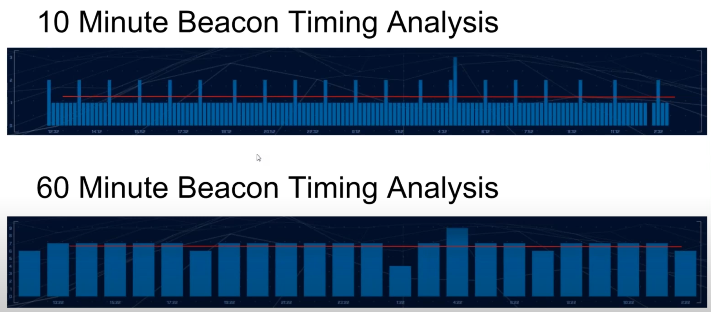

# Beacon analysis

## Fonti e risorse

[**Threat Hunting Beacon Analysis**](https://youtu.be/FzGbVMntLT0?feature=shared)

## Cosa significa *Beacon*?

I beacons sono chiamate inizializzate da un client o agent verso un determinato sistema esterno, come un malware che cerca di contattare ripetutamente il server C2.

## Come individuare i beacons nei file di *Packet Captures*

Prima di tutto è necessaria una base dati corposa, almeno 24 ore, per avere maggiori informazioni da analizzare e *potenzialmente* maggiori possibilità di individuare del traffico malevolo.  

Successivamente è utile identificare le conversazioni tra IP al fine di *ripulire* velocemente i risultati.  

I beacons si identificano per comunicazioni ricorrenti regolari e per dimensione fissa nella lunghezza delle richieste/conversazioni. 
Esempio: malware effettua richieste ogni 60 minuti al C2 con una query fissa per richiedere comandi da eseguire.  

Gli sviluppatori di malware o in ogni caso gli attori malevoli possono introdurre tecniche per rendere **meno** identificabili i loro agent:
- *comunicazioni irregolari*: introduzione di latenza nelle richieste e quindi si *rompe* la regolarità ma l'analisi del traffico in un arco temporale lungo permette comunque l'identificazione dei beacons
- *dimensione richiesta e contenuto irregolare*: introduzione di forme di codifica o crittografia per nascondere il contenuto delle comunicazioni o l'inserimento di byte di padding per celare ulteriormente il contenuto. In ogni caso, l'appesantimento del contenuto fa si che gli host infetti risultano tra i dispositivi più *loquaci*

## Tecniche di analisi

Come primo step da intraprendere prima di avviare un'analisi consiste nel cercare di creare una *baseline* rimuovendo (whitelisting) il rumore noto e sicuro.  
Un esempio di protocollo che si comporta come un beacon è NTP.  

Successivamente una prima analisi comporta il calcolo medio del traffico su base temporale al fine di identificare quelle che sono le deviazioni.

  

Un arco temporale corto potrebbe rendere più difficile identificare i beacons.

Entrando nel dettaglio e analizzando il numero di sessioni e dimensioni totale delle richieste per host, è possibile ipotizzare se una backdoor è stata utilizzata o è dormiente.  
Nel secondo caso tutte le sessioni avranno la stessa dimensione ovvero a ogni domanda corrisponde sempre la stessa risposta (negativa).  
Nel primo caso, invece, compariranno altre sessioni con dimensione più o meno variabile che potrebbero indicare la presenza di eventuali istruzioni e l'invio della risposta degli agent. A questo punto si passa ad una analisi approfondita dell'host e del malware.  

